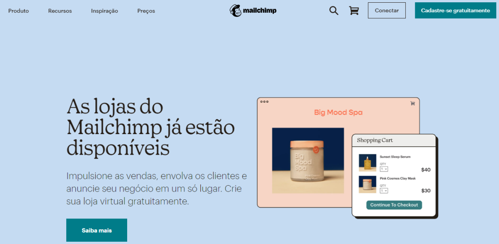

## Homepage Mailchimp
Essa atividade teve como proposta colocar em prática os conceitos básicos de HTML e CSS em prática, com o intuito de clonar essa tela inicial do Mailchimp.

### Tecnologias usadas 💻

